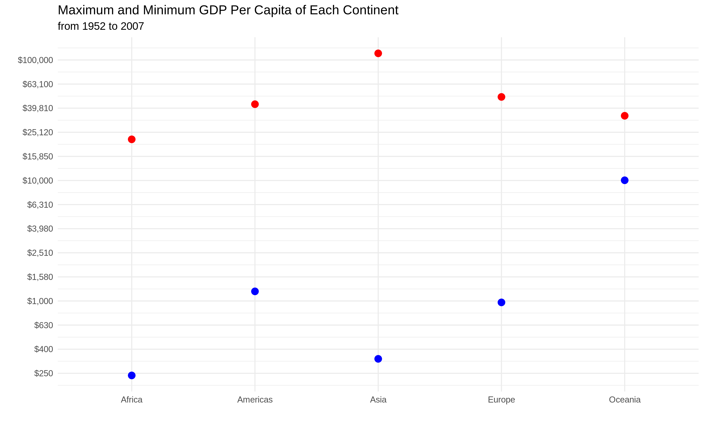

  
```{r setup, include=FALSE}
knitr::opts_chunk$set(echo = TRUE)
```

```{r}
library(gapminder)
library(tidyverse)
library(ggplot2)
library(forcats)
library(here)
library(gridExtra)

```

## Exercise 1: here::here 
**Explain the value of the here::here package**

It is good practice to keep data in separate folders from the working directory (WD) of analysis files. Unlike .R scripts where WD is the top level of the project folder (where the .Rproj is located), for .Rmd files, the WD is the folder that the .Rmd file is located in. This can make importing and exporting files in different paths complicated. The here package is useful in this sense in that it sets the top level of the project folder (or any location you want) as “here”, and specifies locations of files relative to that folder rather than the WD. This allows you to easily set up relevant file structures as you run the script, rather than dealing with complicated pre-determined structures. This allows you to run any R script fresh as it is written. 

Using here:here, you don’t have to set the WD with setwd(), which requires a specific path that would need to modified for each person or everytime you move and/or rename folders. Therefore, here::here makes Rproj analyses more portable across users with their own file struture.  It also is applicable to all operating systems, as the folder-subfolder references are separate strings in the arguments rather than specified by / or \, although traditional path references can be used as well. 


## Exercise 2: Factor Management
**Choose 1 dataset and a variable to explore**

**1. Drop the factors/levels, reorder levels based on knowledge of data**

```{r}
gap <- filter(gapminder, continent != "Oceania") %>%  droplevels() 
nlevels(gap$continent)
```
compared to the original data, there is now one less level in continent:
```{r}
nlevels(gapminder$continent)
```

```{r}
gap_lifeVar <- gap %>%
  group_by(continent) %>%
  summarise(var_life = var(lifeExp))

as_tibble(gap_lifeVar)
```

Now, we will first plot continents against variance of life expectancy their countries had over the years:
```{r}
gap_lifeVar %>% 
  ggplot(aes(continent, var_life)) +
  geom_bar(stat="identity",  fill = "deepskyblue") +
  labs(y="Variance in Life Expectancy", x = "") +
  theme_classic()
```

But this isn't in order! Instead, we will plot in order of the variance of life expectancy over the years.To do this we will use fct_reorder to reorder continent by lowest to highest variance:
```{r}
gap_lifeVar %>%   
  ggplot(aes(fct_reorder(continent, var_life), var_life))  +
  geom_bar(stat="identity", fill = "deepskyblue") +
  labs(y="Variance in Life Expectancy", x = "") +
  theme_classic()
```
 
 
 
 **Exploring the effects of re-leveling on a factor**

Using the same summarised data, the original factor continent is automatically plotted in alphabetical order. Therefore, to demonstrate the effects of arrange() before and after releveling this factor I will arrange continents by descending alphabetical order. 

```{r}
gap_lifeVar %>%
  arrange(desc(continent)) %>%
  as_tibble()
```

To demonstrate how arrange affects releveled factors, I will first relevel the factor content to a random, non-alphabetical order:
```{r}
gap_lifeVar_RL <- gap_lifeVar %>%
  fct_relevel(continent,"Asia", "Europe", "Americas", "Africa")
as_tibble(gap_lifeVar_RL)
```

fct_relevel doesn't seem to work on a tibble! Let's try instead making a single factor continent, and then relevelling it. 

```{r}
gap_lifeVar_RL <- fct_relevel(gap_lifeVar$continent, "Asia", "Europe", "Americas", "Africa")
levels(gap_lifeVar_RL)
```
We see that the levels are releveled in the order we specified. 

When we try to arrange:
```{r}
levels(arrange(gap_lifeVar_RL))
```
We get an error: Error in UseMethod("arrange_") : no applicable method for 'arrange_' applied to an object of class "factor"
Therefore arrange() cannot be used on a factor! 


To show how relevelling can work in generating plots, I will first make a plot showing continent vs. variance in life, which will be automatically in alphabetical order. In the second plot, I have releveled the factors to put Europe first, while all the rest remain in the default alphabetical order. 
```{r}
gap1 <- gap_lifeVar %>% 
  ggplot(aes(continent, var_life)) +
  geom_bar(stat="identity",fill = "deepskyblue") +
  labs(y="Variance in Life Expectancy", x = "") +
  theme_classic()

gap2 <-gap_lifeVar %>% 
  arrange(var_life) %>%
  ggplot(aes(fct_relevel(continent, "Europe"), var_life)) +
  geom_bar(stat="identity",fill = "deepskyblue") +
  labs(y="Variance in Life Expectancy", x = "") +
  theme_classic()

grid.arrange(gap1, gap2, ncol = 2)
```

To demonstrate *further*, I will make a tibble with continents arranged in descending order, then use that to make the same plots again: 
```{r}
gap_desc <- gap_lifeVar %>%
  arrange(desc(continent))
as_tibble(gap_desc)
```

```{r}
gap_desc1 <- gap_desc %>% 
  ggplot(aes(continent, var_life)) +
  geom_bar(stat="identity",fill = "deepskyblue") +
  labs(y="Variance in Life Expectancy", x = "") +
  theme_classic()

gap_desc2 <-gap_desc %>% 
  ggplot(aes(fct_relevel(continent, "Europe"), var_life)) +
  geom_bar(stat="identity",fill = "deepskyblue") +
  labs(y="Variance in Life Expectancy", x = "") +
  theme_classic()

grid.arrange(gap_desc1, gap_desc2, ncol = 2)
```
We see the plots are in the same order as the unarranged tibble. So altogether, we've learned that arranging tibbles has no effects on plots, but relevelling does, and similarily relevelling doesn't work on tibbles. 


## Exercise 3: File Input/Output
**Experiment with a dataset, export it to disk and then reload it**

Here I will summarise some population data in a dataframe gap_pop_summary, save it as a csv file in the folder HW05, and then read to as a new variable gap_populations, and display that as a tibble:
```{r}
gap_pop_summary <- gapminder %>% summarise(mean = mean(pop),
                                           median = median(pop),
                                           stdeviation = sd(pop),
                                           variance = var(pop),
                                           min = min(pop), 
                                           max = max(pop))

write_csv(gap_pop_summary, here::here("HW05", "gap_pop_summmary.csv"))

gap_populations <- read_csv(here::here("HW05", "gap_pop_summmary.csv"))

as_tibble(gap_populations)
```


## Exercise 4: Visualization Design 
**Recreate an old figure in light of something learned recently in class about visualization of design and colour. Juxtapose the two **

My old figure visualized the answer to "how many countries on each contient had a life expectancy below the global median for each year?". However, it was an ineffective visualization because it was a stacked bar chart, which are really difficult to see changes in data besides the "ground" bar.We can sort of see that there are small changes happening, but it's not obvious or appreciable in this visualization. 

Instead, I'll re-do this plot by making a faceted line plot to better show changes in trends for each country. I will also use free Y-axes scales, because the continents have vastly different numbers of countries to begin with, so there is no point on putting them on the same scale (If they were on the same Y-axis scale, it would be better to normalize change to number of countries in continent)
```{r}
#fig1 <- 
#gapminder %>%
 # group_by(year) %>%
  #mutate(median_lifeExp = median(lifeExp)) %>%
  #group_by(continent) %>%
  #filter(lifeExp < median_lifeExp) %>%
  #mutate(num_countries = length(unique(country))) %>%
  #distinct(year, continent, .keep_all =TRUE) %>%  
  #select(continent, year, num_countries) %>%
  #ggplot(aes(factor(year), num_countries, fill = continent, group = continent)) +
  #geom_bar(position="stack", stat="identity") +
  #ylab("Number of Countries") + 
  #xlab("Year") +
  #scale_fill_discrete("Continent") +
  #theme_light()

gapminder %>%
  group_by(year) %>%
  mutate(median_lifeExp = median(lifeExp)) %>%
  group_by(continent) %>%
  filter(lifeExp < median_lifeExp) %>%
  mutate(num_countries = length(unique(country))) %>%
  distinct(year, continent, .keep_all =TRUE) %>%  
  select(continent, year, num_countries) %>%
  ggplot(aes(year, num_countries)) +
  geom_point() +
  facet_grid(~continent) 
  
  ##MAke New facet_grid()

#grid.arrange(fig1, fig2, ncol = 2)
```

## Exercise 5: Writing Figure to File
**Save a plot to file, then load and embed that file into your report**

I will save my updated plot from exercise using ggsave()
```{r}
ggsave("Updated_plot.png", plot = fig2)
```
Here is the plot! 




