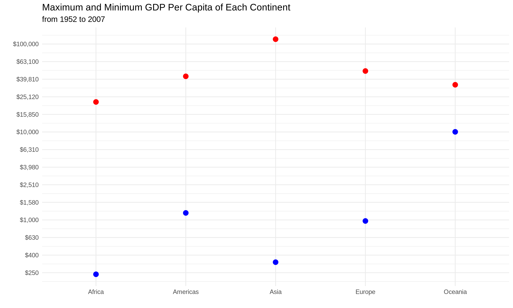

  
```{r setup, include=FALSE}
knitr::opts_chunk$set(echo = TRUE)
```

```{r}
library(gapminder)
library(tidyverse)
library(ggplot2)
library(forcats)
library(here)
library(gridExtra)
library(scales)
```

## Exercise 1: here::here 
**Explain the value of the here::here package**

It is good practice to keep data in separate folders from the working directory (WD) of analysis files. Unlike .R scripts where WD is the top level of the project folder (where the .Rproj is located), for .Rmd files, the WD is the folder that the .Rmd file is located in. This can make importing and exporting files in different paths complicated. The here package is useful in this sense in that it sets the top level of the project folder (or any location you want) as “here”, and specifies locations of files relative to that folder rather than the WD. This allows you to easily set up relevant file structures as you run the script, rather than dealing with complicated pre-determined structures. This allows you to run any R script fresh as it is written. 

Using here:here, you don’t have to set the WD with setwd(), which requires a specific path that would need to modified for each person or everytime you move and/or rename folders. Therefore, here::here makes Rproj analyses more portable across users with their own file struture.  It also is applicable to all operating systems, as the folder-subfolder references are separate strings in the arguments rather than specified by / or \, although traditional path references can be used as well. 


## Exercise 2: Factor Management
**Choose 1 dataset and a variable to explore**

**1. Drop the factors/levels, reorder levels based on knowledge of data**

```{r}
gap <- filter(gapminder, continent != "Oceania") %>%  droplevels() 
nlevels(gap$continent)
```
compared to the original data, there is now one less level in continent:
```{r}
nlevels(gapminder$continent)
```

```{r}
gap_lifeVar <- gap %>%
  group_by(continent) %>%
  summarise(var_life = var(lifeExp))

as_tibble(gap_lifeVar)
```

Now, we will first plot continents against variance of life expectancy their countries had over the years:
```{r}
gap_lifeVar %>% 
  ggplot(aes(continent, var_life)) +
  geom_bar(stat="identity",  fill = "deepskyblue") +
  labs(y="Variance in Life Expectancy", x = "") +
  theme_classic()
```

But this isn't in order! Instead, we will plot in order of the variance (low to high). To do this we will use fct_reorder to reorder continent by lowest to highest variance:
```{r}
gap_lifeVar %>%   
  ggplot(aes(fct_reorder(continent, var_life), var_life))  +
  geom_bar(stat="identity", fill = "deepskyblue") +
  labs(y="Variance in Life Expectancy", x = "") +
  theme_classic()
```
 
 
 
 **Exploring the effects of re-leveling on a factor**

Lets make a small tibble of the number of occurences from each continent:
```{r}
gap_count <- gapminder %>% count(continent)
as_tibble(gap_count)

```
Lets mutate to reorder the levels manually into a aribitrary order:
```{r}
gap_count2 <- gap_count %>%
  mutate(continent = c("Europe","Africa","Asia","Oceania", "Americas"))
as_tibble(gap_count2)
```

Now, rearranging on the orignal and re-leveled data:
```{r}
T1 <- gap_count %>% arrange(desc(continent))
  
T2 <-gap_count2 %>% arrange(desc(continent))

as_tibble(T1)
as_tibble(T2)
```
In T1 (The original data), arranging descending order works the way you expect to, and the class is a factor. 
However in the re-leveled data, arranging changes the continents in the way we'd expected (i.e. in reverse alphabetical order), *BUT* the "n" column is in the same order as it was before we re-leveled continents! The other column did not change when we changed continent levels. As well, the continent class is now a character. 

Let's look at what happens when we plot this data:
```{r}
Plot1 <- T1 %>% 
  ggplot(aes(continent, n)) +
  geom_bar(stat="identity",fill = "deepskyblue") +
  labs(y="Number of Occurences in Data", x = "", title = "Original data") +
  theme_classic()

Plot2 <- T2 %>% 
  ggplot(aes(continent, n)) +
  geom_bar(stat="identity",fill = "deepskyblue") +
  labs(y="Number of Occurences in Data", x = "", title = "Re-leveled data") +
  theme_classic()

grid.arrange(Plot1, Plot2, ncol=2)
```
There are lots of things wrong with this:
* Arranging doesn't affect the plots, so they have continents back to their original alphabetical order.
* Because we have re-leveled the data before plotting, the n occurences don't correspond to the right continents in the second plot (ex. Oceania had 24, now it has 360!)

To show how relevelling can actually be useful in generating plots, I will first make a plot showing continent vs. variance in life (same plot as in 2.1), which will be automatically in alphabetical order. In the second plot, I have releveled the factors to put Europe first, while all the rest remain in the default alphabetical order. 
```{r}
gap1 <- gap_lifeVar %>% 
  ggplot(aes(continent, var_life)) +
  geom_bar(stat="identity",fill = "deepskyblue") +
  labs(y="Variance in Life Expectancy", x = "") +
  theme_classic()

gap2 <-gap_lifeVar %>% 
  arrange(var_life) %>%
  ggplot(aes(fct_relevel(continent, "Europe"), var_life)) +
  geom_bar(stat="identity",fill = "deepskyblue") +
  labs(y="Variance in Life Expectancy", x = "") +
  theme_classic()

grid.arrange(gap1, gap2, ncol = 2)
```
We can see here that in both cases all the continents correspond to the right values, so it doesn't change how accurate our data is. This way we can re-level it in however we want! We just have to make sure to re-level it in ggplot() rather than before. 

## Exercise 3: File Input/Output
**Experiment with a dataset, export it to disk and then reload it. With the imported data, play around with factor levels and use factors to order your data with one of your factors. Comment on whether or not your newly created file survived the round trip of writing to file then reading back in.**

I will test this on 2 different csvs. 

*1st test*
For gap_test1, will filter gapminder data to only year 2007, and only Europe. 
```{r}
gap_test1 <- gapminder %>% filter(year == "2007",continent=="Europe")

class(gap_test1$continent)
nlevels(gap_test1$continent)
levels(gap_test1$continent)
```
Although we filtered to just Europe, there are still 5 levels in our continent factor: "Africa"   "Americas" "Asia"     "Europe"   "Oceania"

Next I will save it as a csv file in the folder HW05, and then read to as a new variable gap_populations, and check the  class again and levels again:
```{r}
write_csv(gap_test1, here::here("HW05", "gap_test1.csv"))
gap_test1 <- read_csv(here::here("HW05", "gap_test1.csv"))
class(gap_test1$continent)
```

We see that the class is now a character! We have lost the other continent levels from the data during I/O of the file. 

*2nd test
Now, I will use a small tibble, re-level a column and try I/O again to see what happens:
```{r}
gap_test2 <- gapminder %>% count(continent)

class(gap_test2$continent)
nlevels(gap_test2$continent)
levels(gap_test2$continent)
```


Again, continent is a factor with the same 5 levels. Now, I will re-level, write the file out and in, and see what happens to the levels:
```{r}
gap_test2 <- gap_test2 %>% 
  mutate(continent = c("Europe","Africa","Asia","Oceania", "Americas")) 

write_csv(gap_test2, here::here("HW05", "gap_test2.csv"))

gap_test2 <- read_csv(here::here("HW05", "gap_test2.csv"))

class(gap_test2$continent)
as_tibble(gap_test2)
```
The class continent is again now a character, but the levels are preserved the same way we specified before writing out. (However, the n column corresponds to the wrong continent, it did not change - this could really mess up your analyses)

## Exercise 4: Visualization Design 
**Recreate an old figure in light of something learned recently in class about visualization of design and colour. Juxtapose the two **

My first plot attempts to show the maximum and minimum GDP per capita each continent had for each year. However, this pot doesn't effectively communicate the data well, because it doesn't highlight the data (too much background distraction), and the scale that it is on doesn't show appreciable changes in the "minimum" data points. 

What I changed:
* connected dots wtih line to see trend better
* changed to y scale to log10 to better see changes in lower values
* set more y ticks to clearly show changes in ammounts
* added dollar signs to y axis, and rounded to nearest $10
* reduced background distraction and changed dot colour
* took out redundant "Continent" X-axis label (we know they're continents), and just explained Y axis in title 
A lot of this is done using the "scales" package

```{r}
fig1 <-gapminder %>%
  group_by(continent) %>%
  summarize(max = max(gdpPercap), min = min(gdpPercap)) %>%
  ggplot(aes(continent)) +
  geom_point(aes(continent, max, color = "Maximum",size = 3)) +
  geom_point(aes(continent, min,color= "Minimum",size = 3))  +
  scale_color_discrete("") +
  xlab("Continent") +
  scale_y_continuous("GDP Per Capita", breaks=seq(0,120000,10000), labels=waiver()) +  
  guides(size = FALSE) 

fig2 <-gapminder %>%
  group_by(continent) %>%
  summarize(Max = max(gdpPercap), Min = min(gdpPercap)) %>%
  ggplot(aes(continent)) +
  geom_point(aes(continent, Max), color = "red", size = 3) +
  geom_point(aes(continent, Min), color= "blue", size = 3)  +
  scale_y_continuous(trans='log10',
                     breaks = trans_breaks("log10", function(x) 10^x, n = 20), 
                     labels = dollar_format(accuracy = 10)) +
  labs(title ="Maximum and Minimum GDP Per Capita of Each Continent", 
       subtitle = "from 1952 to 2007", x = "", y = "") +
  theme_minimal()

grid.arrange(fig1, fig2, ncol = 2)
```


## Exercise 5: Writing Figure to File
**Save a plot to file, then load and embed that file into your report**

I will save my updated plot from exercise 4 using ggsave(). 
```{r}
ggsave("Updated_plot.png", plot = fig2,
       dpi = 300, 
       width = 10,
       height = 6)
```
Here is the plot! 



